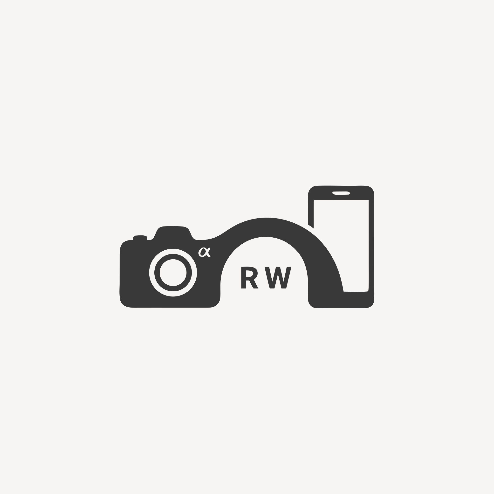

<div align="center">
  <p>
    
  </p>
  <h1>Snoy-RawBridge</h1>
  <p>
    <a href="./README_EN.md">English</a> |
    <a href="./README.md">简体中文</a>
  </p>
</div>

Snoy-RawBridge 是一个面向索尼相机的 Android 有线传图应用，支持先浏览缩略图，再按需导入选中的 RAW / JPEG 原文件。

它围绕有线工作流设计：缩略图优先浏览、MTP 作为主路径、PTP 作为兼容路径，同时避免把整张存储卡完整镜像到手机。

## 项目简介

Snoy-RawBridge 面向希望在 Android 手机上直接浏览相机内容、并按需导入原片的用户。

它不是先把整卡内容全部复制到本地，而是先建立 USB 浏览会话，在相机侧枚举媒体对象，展示缩略图或内嵌预览，只有在用户明确选择后才传输原始文件。

整个流程更像一个系统工具：
- 接上相机
- 浏览卡内内容
- 挑选真正需要的照片
- 再导入原始文件

## 核心特性

- 面向 Android USB Host / OTG 的有线 USB 工作流
- 适配索尼相机场景的浏览与导入体验
- MTP 主路径，保留 PTP 兼容能力
- RAW / JPEG 缩略图优先浏览
- 支持多选、筛选和批量导入
- 支持导入进度、停止导入和历史记录
- 支持保存目录配置、按日期建目录、RAW / JPEG 分目录
- 会话缩略图缓存随断开或结束自动清理
- 支持浅色、深色、跟随系统三种主题

## 工作方式

- App 通过 Android USB Host API 检测并连接相机。
- 获得 USB 权限后，探测当前可用的浏览模式。
- 先在相机侧枚举媒体对象，而不是把整张卡完整复制到手机。
- 优先显示 JPEG 缩略图或 RAW 内嵌预览。
- 只有用户选中并点击导入后，才会拉取原始 RAW / JPEG 文件。
- 导入后的文件通过 MediaStore 写入，因此可在系统相册和文件管理器中直接看到。

## 快速开始

运行要求：
- Android 8.0 及以上（`minSdk 26`）
- 手机支持 USB Host / OTG
- 相机通过可传输数据的 USB 线连接手机

构建 Debug：

```powershell
.\gradlew.bat assembleDebug
```

构建 Release：

```powershell
.\gradlew.bat :app:assembleRelease
.\gradlew.bat :app:bundleRelease
```

安装到手机：

```powershell
adb install -r app\build\outputs\apk\debug\app-debug.apk
adb install -r app\build\outputs\apk\release\app-release.apk
```

## 文档

- [使用文档.md](使用文档.md)

## 技术栈

- Kotlin
- Jetpack Compose
- Material 3
- Android USB Host API
- MTP / PTP 浏览与导入链路
- Room
- DataStore
- Coil

## 项目结构

```text
app/                前端 UI 与页面交互
transfer-backend/   USB 会话、文件枚举、导入、历史、设置
gradle/             Gradle Wrapper 与版本目录
icon.svg            图标源文件
```

## 兼容性说明

- MTP 是当前的主路径，也是默认推荐模式。
- PTP 保留为兼容路径，不同机型或 USB 模式下表现可能不同。
- 大容量存储卡下，完整图库加载速度仍会受到相机端枚举速度影响，即使当前已经支持缩略图增量出图。

## 作者

- GitHub: [XavierZane / Snoy-RawBridge](https://github.com/XavierZane/Snoy-RawBridge)

## 许可证

本项目基于 Apache License 2.0 开源，详见 [LICENSE](LICENSE)。
